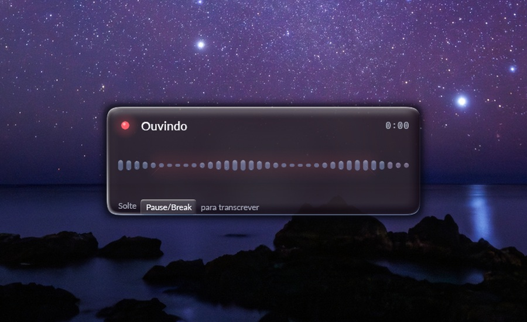
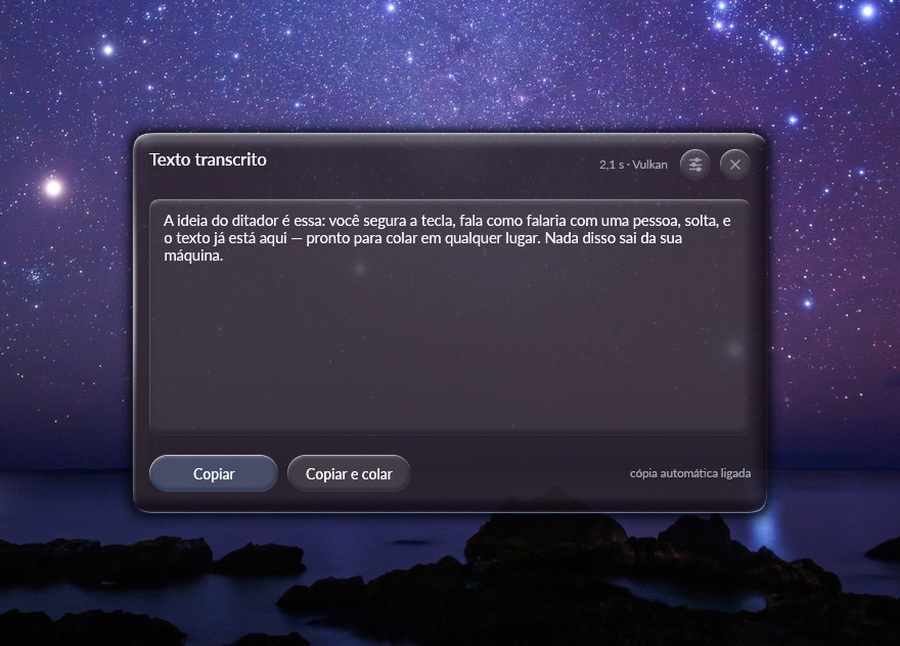
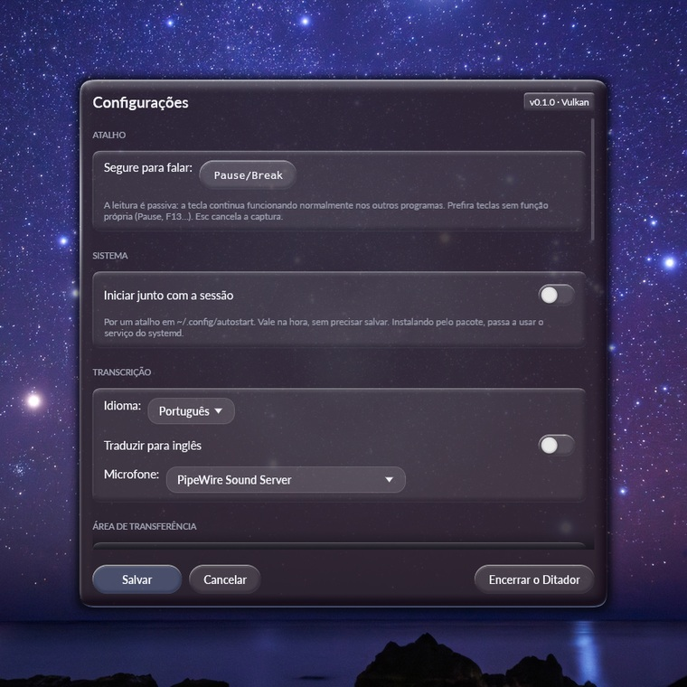

<p align="center">
  
</p>

<h1 align="center">Ditador</h1>

<p align="center">
  Ditado por voz <b>offline</b> para Ubuntu/GNOME, em Rust, com o Whisper na GPU.<br>
  Segure <b>Pause/Break</b>, fale, solte. Nada sai da sua máquina.
</p>

<p align="center">
  
</p>

## Como começar

**Com o pacote pronto** (Ubuntu 24.04 ou mais novo):

```bash
sudo apt install ./ditador_0.3.0_amd64.deb      # ou ditador-cpu_… se a máquina não tem GPU
sudo usermod -aG input $USER                    # para o atalho global ler o teclado
```

Saia da sessão e entre de novo. Abra o **Ditador** pelo menu de aplicativos: na
primeira vez ele oferece baixar o modelo de transcrição (~574 MB) ali mesmo, com
barra de progresso. Depois disso, tudo roda sem internet.

Em *Configurações → Sistema* está o interruptor **Iniciar junto com a sessão** —
ligue e o Ditador sobe sozinho toda vez que você entrar, já em segundo plano.

**Compilando você mesmo:**

```bash
sudo apt install -y cmake libasound2-dev libvulkan-dev glslc wl-clipboard
./instalar.sh                 # ou: ./instalar.sh cpu   |   ./instalar.sh cuda
ditador --baixar-modelo
```

**Gerando o pacote para outra máquina:**

```bash
./empacotar.sh                # target/deb/ditador_0.3.0_amd64.deb  (Vulkan)
./empacotar.sh cpu            # target/deb/ditador-cpu_0.3.0_amd64.deb
```

O pacote leva o programa, os ícones, o atalho do menu e o serviço de usuário do
systemd. Não leva o modelo: são centenas de megabytes, e a própria janela o
baixa na primeira vez.

<p align="center">
  
</p>

## Como funciona

```
evdev (/dev/input/event*)  ──►  controlador  ──►  cpal (microfone)
   segurar/soltar a tecla         │                    │ 16 kHz mono
                                  │                    ▼
   interface egui  ◄──────────────┤             whisper.cpp (Vulkan)
   vidro / animação / resultado   │                    │
                                  │  ◄─────────────────┘
   ícone da barra  ◄──────────────┘        texto
   StatusNotifierItem
```

Seis threads conversando por canais: leitura de teclado, áudio, inferência,
controlador, interface e ícone. O estado compartilhado fica num `Mutex` só, e
o `Sinal` avisa a interface (repintando) e o ícone (que relê o estado) a cada
mudança — um canal de capacidade 1 por observador, para que avisos em rajada
se fundam num só.

## Uso

| Ação | Como |
|---|---|
| Ditar | Segure **Pause/Break**, fale, solte |
| Copiar | Botão **Copiar** (ou automático, já vem ligado) |
| Configurar | Ícone da barra → *Configurações*, ou `ditador --configuracoes` |
| Alternar gravação sem segurar tecla | Ícone da barra → *Ditar agora*, ou `ditador --alternar` |
| Baixar outro modelo | `ditador --baixar-modelo medium-q5_0` |
| Ver estado | `ditador --status` |
| Encerrar | Ícone da barra → *Encerrar*, ou `ditador --encerrar` |

`./baixar-modelo.sh --lista` mostra os modelos disponíveis e o tamanho de cada um.

### Ícone na barra superior

Enquanto o Ditador está no ar, um ícone fica na barra de cima e mostra o estado
sem precisar abrir nada:

| Ícone | Significa |
|---|---|
| microfone | pronto — segure o atalho e fale |
| ponto de gravação | ouvindo |
| carregando | transcrevendo, ou carregando o modelo |
| triângulo de aviso | o modelo não carregou |

Clicar abre o menu: *Ditar agora*, *Configurações*, *Encerrar*.

O GNOME não tem bandeja nativa; o ícone é um **StatusNotifierItem**, exibido
pela extensão *Ubuntu AppIndicators*, que vem habilitada no Ubuntu. Se ela
estiver desligada, o Ditador funciona igual — só avisa no log que ficou sem
ícone.

Nas configurações dá para trocar o atalho (clique no botão e pressione a nova
tecla ou combinação), o idioma, o microfone, o modelo, ligar a colagem
automática, mandar o programa subir junto com a sessão e mexer no vidro.

Com a cópia automática ligada dá para **desligar a janela de resultado** (*Área
de transferência → Mostrar a janela com o texto transcrito*): aí é falar, soltar
e colar, sem nada aparecer na frente. A janela volta a aparecer sozinha se o
texto não tiver chegado à área de transferência — a transcrição não se perde por
causa de uma preferência.

<p align="center">
  
</p>

## Decisões que valem explicar

**Por que ler `/dev/input` em vez de usar o atalho do GNOME.** No Wayland o
GNOME não entrega o evento de *soltar* a tecla para aplicativos comuns, então
"segurar para falar" seria impossível. A leitura do evdev é passiva: as teclas
continuam chegando normalmente ao programa em foco. Por isso o atalho padrão é
o Pause/Break — uma tecla sem função própria em lugar nenhum.

Se preferir não usar o grupo `input`, dá para criar um atalho do GNOME apontando
para `ditador --alternar`: aí é apertar uma vez para começar e outra para parar.

**Por que Vulkan e não CUDA.** O CUDA 12.4, única versão nos repositórios do
Ubuntu 26.04, não compila contra a glibc 2.43 do sistema. O Vulkan usa a mesma
GPU, já vinha instalado com o driver e roda o `large-v3-turbo` em ~0,6 s por
frase. Para compilar com CUDA (exige o toolkit da NVIDIA):

```bash
./instalar.sh cuda    # ou: ./instalar.sh cpu
```

**Por que a janela vai pelo XWayland.** No Wayland um aplicativo comum não
escolhe onde sua janela aparece nem consegue ficar por cima das outras — as duas
coisas que uma sobreposição de ditado precisa. Pelo X11 funciona. Desligue em
*Configurações → Avançado* se preferir Wayland nativo.

**Como o vidro é feito.** Cada peça — o painel, os cartões, os botões, os
interruptores — sai de um shader GLSL (`src/glass_gpu.rs`) que faz a óptica
pixel a pixel, na mesma linha da extensão de GNOME
[liquid-glass](https://github.com/ryohsuke1231/liquid-glass):

* silhueta de **squircle**, direto na função de distância: os cantos são
  superelipse (`|x/r|⁴·² + |y/r|⁴·² = 1`), não arcos de círculo, que é o que dá
  a curva contínua dos cantos da Apple. Cápsulas e círculos voltam ao arco;
* **relevo com altura de verdade**: um perfil de superelipse faz a superfície
  subir da borda até o meio, e a normal em 3D sai por diferenças finitas desse
  campo de altura;
* **refração pela lei de Snell**: o raio que entra de frente sai torto dentro do
  vidro, e o quanto ele anda de lado é o deslocamento da amostra do fundo —
  mais **aberração cromática**, porque cada cor entorta um pouco diferente;
* **borda especular com direção**, em duas escalas: um fio bem em cima do
  contorno (a nitidez da quina) e um realce mais largo descendo pelo bisel (a
  espessura acendendo). Ela acende onde a normal encara a luz e azula do lado
  oposto, onde só resta o retorno frio de quem atravessou a peça — e ganha um
  brilho extra por onde o cursor passa, como vidro polido sob a mão;
* **reflexo, véu e oclusão**: Blinn para o brilho concentrado, queda angular
  para o véu da face e uma faixa escura por dentro da borda, onde o próprio
  corpo do vidro tapa a luz;
* **sombra projetada** com umbra e penumbra separadas, seguindo a silhueta;
* **mola na abertura**: a tela entra crescendo do próprio centro, com uma
  ultrapassagem curta antes de assentar. A escala vai numa transformação da
  camada, então pega tudo de uma vez — vidro, texto e controles — e o shader
  descobre a escala comparando o retângulo que recebeu com o que pediu.

Cada peça é um único quadrilátero. Fora da silhueta o shader devolve o pixel do
fundo intocado, o que deixa desenhar com a mistura desligada sem deixar rastro —
e passado o bisel, onde a superfície é plana, ele pula o campo de altura inteiro.
Na tela de configurações, com umas 25 peças, isso dá **~1,2 ms por quadro**,
contra 2,3 ms do desenho vetorial que havia antes: o vidro por GPU é o dobro
mais rápido, não mais caro.

Se a GPU não estiver disponível — ou com `DITADOR_SEM_GPU=1` — o mesmo
vocabulário sai em vetores pelo `src/glass.rs`, empilhando as pistas em camadas.

**O que o vidro refrata.** O painel refrata uma **captura da tela**, recortada
na posição da janela. Ela vem do `org.freedesktop.portal.Screenshot`, que é a
única porta aberta: o GNOME nega o `org.gnome.Shell.Screenshot` a aplicativos
comuns desde a versão 41, e sob XWayland o `XGetImage` na raiz responde
`BadMatch`.

A foto só é tirada **com a janela escondida** — na abertura do programa e depois
de cada vez que a janela some. Não é economia: uma foto tirada com a janela na
tela conteria a própria janela, e o vidro passaria a refratar a si mesmo. O
portal não deixa excluir a nossa janela do quadro. Daí a limitação que fica: a
imagem é a de pouco antes de a janela abrir e não se mexe enquanto ela estiver
aberta — um vídeo tocando atrás fica parado no vidro. Sem uma extensão rodando
dentro do compositor, que é o caminho da extensão de GNOME de referência e que
um aplicativo comum não tem, não há como fazer melhor.

Sem portal de captura, o painel cai no **papel de parede** da área de trabalho:
o caminho vem do GNOME (`picture-uri`, seguindo o tema claro/escuro) e a imagem é
reduzida, borrada e escurecida numa thread à parte. Não é o que está atrás — uma
janela por baixo não aparece —, é só a cor do desktop naquele ponto. As duas
fontes entram com alfa parcial: o que estiver mesmo atrás continua aparecendo
pelo canal alfa da janela. Desligue em *Configurações → Aparência* para deixar o
painel só com a tinta escura.

Já tudo que fica **dentro** do painel refrata uma cópia do próprio framebuffer,
tirada logo antes de desenhar a peça — e esse fundo é exato: a beirada de um
botão realmente entorta o texto e o vidro que estão embaixo dele.

Os controles (`src/widgets.rs`) são feitos das mesmas peças: botões em cápsula,
interruptores que deslizam, cartões agrupando as configurações — todos acendem
sob o cursor e afundam ao serem pressionados.

**Por que o programa sai com `_exit`.** Liberar os buffers da GPU enquanto a
thread principal desmonta o contexto gráfico derruba o driver da NVIDIA
(SIGSEGV dentro de `ggml_backend_vk_buffer_free_buffer`). Como o systemd leria
isso como falha e reiniciaria o serviço, o encerramento pula os destrutores
globais — o sistema recupera a memória de qualquer jeito.

**Como o "iniciar com a sessão" funciona.** Quando o serviço de usuário do
systemd está instalado (é o caso pelo pacote e pelo `instalar.sh`), o
interruptor faz `systemctl --user enable ditador`. Sem ele — quem só compilou e
rodou —, escreve um atalho em `~/.config/autostart`, que qualquer ambiente
gráfico entende. Desligar limpa os dois, para não sobrar resquício de uma
instalação anterior mandando o programa subir.

## Configuração

`~/.config/ditador/config.json`. Quase tudo aparece na tela de configurações; os
campos menos usados ficam em *Avançado* e em *Aparência*.

Um campo que vale conhecer: `initial_prompt`. O texto que você puser ali vai
como contexto para o modelo — útil para nomes próprios, jargão da sua área ou
para induzir um estilo de pontuação.

O bloco `appearance` tem o vidro inteiro, inclusive o que a tela não expõe. Os
controles deslizantes valem no quadro seguinte, então dá para ver o efeito
enquanto se arrasta:

| Campo | Padrão | O que faz |
|---|---|---|
| `screen_capture` | `true` | refratar a captura da tela; desligado, usa o papel de parede |
| `wallpaper` / `wallpaper_opacity` | `true` / `0.55` | imagem de fundo por baixo do vidro, e quanto dela aparece |
| `wallpaper_detail` | `260` | largura para a qual o papel de parede é reduzido — é o controle do desfoque. Não vale para a captura da tela, que entra na resolução cheia |
| `wallpaper_brightness` / `wallpaper_saturation` | `0.55` / `1.18` | escurecer e colorir antes de entrar |
| `refraction` | `1.52` | índice de refração: 1,0 não entorta nada, vidro real ~1,5 |
| `thickness` / `chromatic` | `1.0` / `1.0` | espessura aparente e separação das cores |
| `edge` / `specular` / `sheen` / `occlusion` | `1.0` | multiplicadores da luz |
| `shadow` | `0.62` | sombra projetada do painel |
| `animation` / `animation_ms` | `true` / `260` | a mola de abertura e a duração dela |
| `animation_bounce` / `animation_scale` | `0.6` / `0.94` | quanto ela ultrapassa o alvo e de que tamanho parte |

Valores fora de faixa são aparados na leitura — o arquivo é editável à mão, e um
índice de refração de 40 deixaria a janela ilegível.

## Desenvolvimento

```bash
cargo test                       # vidro, mola, config, reamostragem, texto
RUST_LOG=debug cargo run         # inclui o texto transcrito no log
DITADOR_CAPTURA=/tmp/shots cargo run --release   # grava um PNG de cada tela
DITADOR_QUADROS=1 cargo run --release            # quadros/s, sem sincronia vertical
DITADOR_SEM_GPU=1 cargo run --release            # força o desenho vetorial
```

A captura existe porque o GNOME nega a API de screenshot a aplicativos comuns,
e sem ela não há como conferir o desenho da interface. As imagens deste README
saem dela, compostas sobre o papel de parede na posição em que a janela de fato
aparece na tela.

**Ícones.** `assets/ditador.svg` é o ícone colorido — a mesma peça de vidro do
aplicativo, com o microfone dentro. `assets/simbolicos/` traz os quatro estados
da barra superior (pronto, gravando, trabalhando, falhou), só com formas
preenchidas, que é o que o GTK consegue recolorir. Depois de mexer neles:

```bash
python3 assets/gerar-icones.py    # rasteriza assets/png/ (usa o librsvg do GNOME)
```

Os PNGs ficam versionados porque o binário os embute: a janela precisa do ícone
antes de qualquer instalação, e a bandeja usa os símbolos em branco como reserva
quando o tema do sistema ainda não tem os nossos.

## Limitações conhecidas

- **Colagem automática** (desligada por padrão) depende do `ydotool` e de a
  janela em foco continuar sendo a sua — a sobreposição pode roubar o foco em
  alguns gerenciadores de janela. A cópia automática não tem esse problema.
- O microfone é aberto no momento em que você pressiona a tecla; em máquinas
  lentas isso pode cortar a primeira sílaba.
- Trocar de modelo com o programa aberto libera o contexto anterior da GPU; se
  isso se mostrar instável no seu driver, reinicie o serviço depois de trocar.

## Licença

[MIT](LICENSE). Os modelos do Whisper têm licença própria (MIT também, da
OpenAI) e são baixados à parte, não distribuídos aqui.
