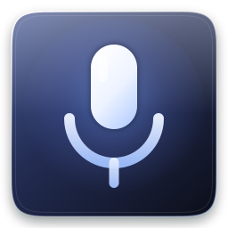
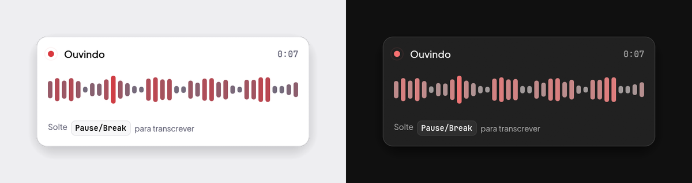
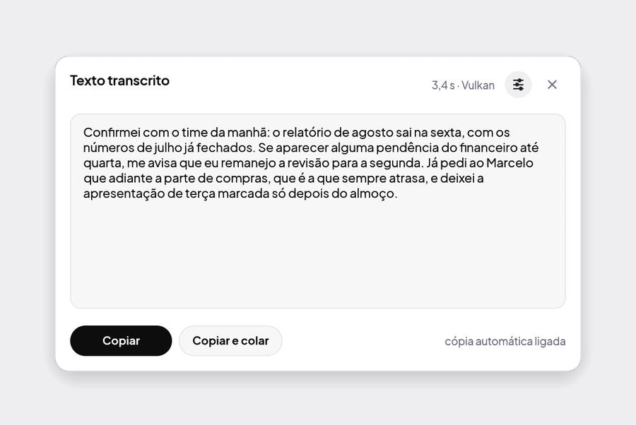
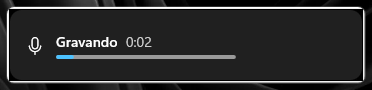
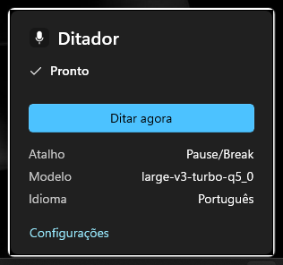
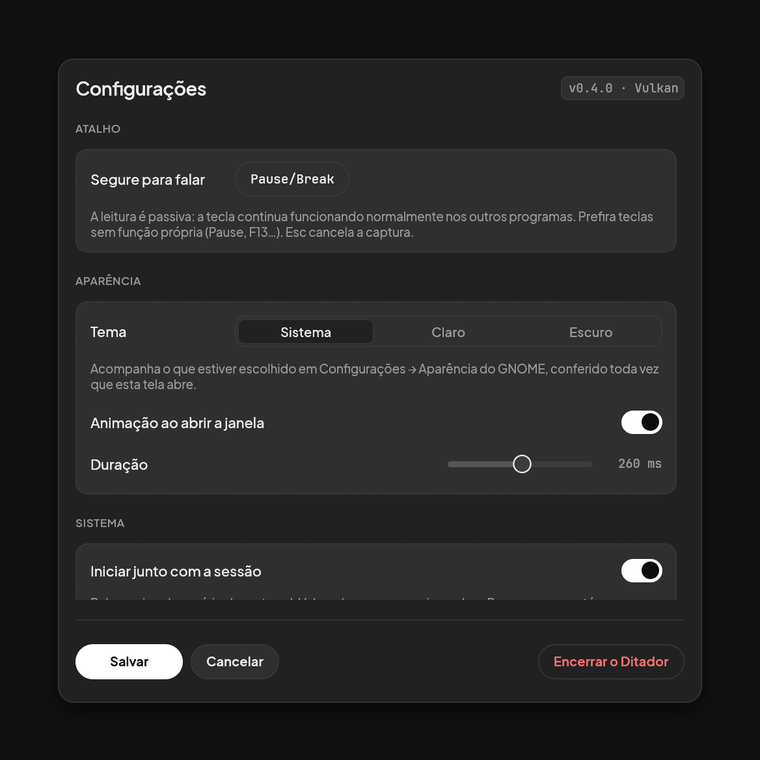

<p align="center">
  
</p>

<h1 align="center">Ditador</h1>

<p align="center">
  Ditado por voz <b>offline</b> para Linux e Windows, em Rust, com o Whisper na GPU.<br>
  Segure <b>Pause/Break</b>, fale, solte. Nada sai da sua máquina.
</p>

<p align="center">
  
</p>

<p align="center">
  <i>Tema claro e tema escuro, acompanhando o do sistema.</i>
</p>

## Como começar

**Com o pacote pronto** (Ubuntu 24.04 ou mais novo):

```bash
sudo apt install ./ditador_*_amd64.deb          # ou ditador-cpu_… se a máquina não tem GPU
sudo usermod -aG input $USER                    # para o atalho global ler o teclado
```

O `.deb` sai da [página de versões](https://github.com/DanielFreitasDev/ditador/releases/latest).
Se algo não funcionar, `ditador --diagnostico` confere, um a um, tudo de que o
programa depende e diz o que está faltando.

Saia da sessão e entre de novo. Abra o **Ditador** pelo menu de aplicativos: na
primeira vez ele oferece baixar o modelo de transcrição (~574 MB) ali mesmo, com
barra de progresso. Depois disso, tudo roda sem internet.

Em *Configurações → Sistema* está o interruptor **Iniciar junto com a sessão** —
ligue e o Ditador sobe sozinho toda vez que você entrar, já em segundo plano.

**Compilando você mesmo:**

```bash
sudo apt install -y build-essential cmake libasound2-dev libvulkan-dev glslc wl-clipboard
./instalar.sh                 # ou: ./instalar.sh cpu   |   ./instalar.sh cuda
ditador --baixar-modelo
```

O `build-essential` é o que traz o compilador de C++ que o cmake do whisper.cpp
procura; sem ele a compilação para logo no começo, em *No CMAKE_CXX_COMPILER
could be found*.

**Gerando o pacote para outra máquina:**

```bash
./empacotar.sh                # target/deb/ditador_<versão>_amd64.deb  (Vulkan)
./empacotar.sh cpu            # target/deb/ditador-cpu_<versão>_amd64.deb
```

O pacote leva o programa, os ícones, o atalho do menu e o serviço de usuário do
systemd. Não leva o modelo: são centenas de megabytes, e a própria janela o
baixa na primeira vez.

<p align="center">
  
</p>

## Como funciona

```
evdev (/dev/input/event*)  ──►  controlador  ──►  cpal (microfone)
   segurar/soltar a tecla         │                    │ 16 kHz mono
                                  │                    ▼
   interface egui  ◄──────────────┤             whisper.cpp (Vulkan)
   gravando / resultado / config  │                    │
                                  │  ◄─────────────────┘
   ícone da barra  ◄──────────────┤        texto
   StatusNotifierItem             │
                                  └──►  D-Bus  ──►  extensão do GNOME Shell
                                                    (opcional)
```

Threads conversando por canais: leitura de teclado, áudio, inferência,
controlador, interface, ícone e D-Bus. O estado compartilhado fica num `Mutex`
só, e o `Sinal` avisa a interface (repintando), o ícone e o D-Bus (que releem o
estado) a cada mudança — um canal de capacidade 1 por observador, para que
avisos em rajada se fundam num só.

## Uso

| Ação | Como |
|---|---|
| Ditar | Segure **Pause/Break**, fale, solte |
| Copiar | Botão **Copiar** (ou automático, já vem ligado) |
| Configurar | Ícone da barra → *Configurações*, ou `ditador --configuracoes` |
| Alternar gravação sem segurar tecla | Ícone da barra → *Ditar agora*, ou `ditador --alternar` |
| Baixar outro modelo | `ditador --baixar-modelo medium-q5_0` |
| Ver estado | `ditador --status` |
| Encerrar | Ícone da barra → *Encerrar*, ou `ditador --encerrar` |

`./baixar-modelo.sh --lista` mostra os modelos disponíveis e o tamanho de cada um.

### Ícone na barra superior

Enquanto o Ditador está no ar, um ícone fica na barra de cima e mostra o estado
sem precisar abrir nada:

| Ícone | Significa |
|---|---|
| microfone | pronto — segure o atalho e fale |
| ponto de gravação | ouvindo |
| carregando | transcrevendo, ou carregando o modelo |
| triângulo de aviso | o modelo não carregou |

Clicar abre o menu: *Ditar agora*, *Configurações*, *Encerrar*.

O ícone é um **StatusNotifierItem**. No GNOME, que não tem bandeja nativa, quem
o exibe é a extensão *Ubuntu AppIndicators*, que vem habilitada no Ubuntu; no
KDE Plasma a bandeja do sistema o mostra sem precisar de nada. Onde não houver
nenhum dos dois, o Ditador funciona igual — só avisa no log que ficou sem ícone.

### Integração com o GNOME Shell

Há uma **extensão oficial opcional** para o GNOME Shell 50.x (testada na 50.1,
Ubuntu 26.04, Wayland). Com ela, o Ditador aparece onde o GNOME põe as coisas do
GNOME: um indicador na barra superior, um controle nas *Configurações rápidas* e
o aviso de gravação no OSD do Shell, com cronômetro — em vez da sobreposição
própria do aplicativo.

```bash
./instalar.sh                    # o aplicativo primeiro
./gnome-extension/instalar.sh    # depois a extensão
```

Na primeira instalação é preciso sair da sessão e entrar de novo: o GNOME Shell
só procura extensões novas ao iniciar, e numa sessão Wayland não há como
recarregá-lo. Depois disso, `gnome-extensions disable ditador@danielfreitasdev.github.io`
e o `enable` correspondente valem na hora.

Os dois lados conversam por **D-Bus** (`io.github.danielfreitasdev.Ditador`) — o
socket Unix continua sendo o caminho da linha de comando, e nada dele muda. A
extensão não grava áudio, não transcreve, não lê o teclado e não acessa a rede:
ela só desenha o estado que o processo Rust publica.

Quando a extensão está no ar, o ícone do StatusNotifierItem e a sobreposição de
"gravando" saem de cena, para o mesmo recado não aparecer duas vezes. Isso não
depende de a extensão se despedir: enquanto ela vive, segura um nome no
barramento, e o barramento o solta sozinho se o Shell reiniciar ou se ela morrer
sem avisar — aí os dois voltam.

**Sem a extensão nada muda**: StatusNotifierItem, sobreposição própria, socket
Unix e `evdev`, como sempre. Em outra área de trabalho, idem. O atalho global
continua sendo o `evdev` nos dois casos — a extensão não tenta substituí-lo,
porque o GNOME não entrega o evento de *soltar* a tecla e sem ele "segurar para
falar" não existe.

Os detalhes técnicos — interface D-Bus, ciclo de vida, testes, diagnóstico —
estão em [`gnome-extension/README.md`](gnome-extension/README.md).

### Integração com o KDE Plasma

Também opcional, e também oficial: um **widget do Plasma** para o KDE Plasma 6
(feito e testado no Kubuntu 26.04, Plasma 6.6.6, Qt 6.10.2, KDE Frameworks
6.24.0, Wayland). Ele põe o Ditador na bandeja do sistema como um componente do
Plasma — ícone que segue o estado, popup nativo com o botão de ditar, o
cronômetro da gravação, o nível do microfone e o que está em uso.

```bash
./instalar.sh                 # o aplicativo primeiro
./kde-plasma/instalar.sh      # depois o widget
```

Depois, botão direito na bandeja → *Configurar a Bandeja do Sistema* →
*Entradas*, e ponha "Ditador" em *Mostrado*. O widget só aparece com o Ditador em
execução: ele se declara pelo `X-Plasma-DBusActivationService`, e o
`plasmashell` o carrega quando o serviço aparece no barramento.

É a **mesma interface D-Bus** da extensão do GNOME — não há uma API para cada
área de trabalho. A cópia canônica do contrato está em
[`dbus/contrato.xml`](dbus/contrato.xml), e o cliente Qt é gerado dela em tempo
de compilação; um teste do `cargo test` confere que os três lados (Rust, GNOME,
Plasma) continuam dizendo a mesma coisa.

Como no GNOME, o ícone do StatusNotifierItem sai de cena enquanto o widget está
carregado, pelo mesmo mecanismo: o widget segura um nome no barramento, e o
barramento o solta sozinho se o `plasmashell` cair ou o widget for removido — aí
o ícone volta, sem reiniciar nada.

O que **não** muda no Plasma é o aviso de gravação: ele continua sendo a janela
do próprio Ditador. Não é trabalho pela metade — no Plasma 6.6 não existe API
pública que desenhe um aviso passivo por cima da cena, e a explicação por
extenso, com o código do KWin que a sustenta, está no
[`kde-plasma/README.md`](kde-plasma/README.md). Ali também estão a instalação
detalhada, a atualização, a remoção só da integração e os comandos de
diagnóstico.

Uma diferença de forma em relação ao GNOME: metade do widget é um plugin C++
compilado (o QML do Plasma 6 não fala D-Bus sozinho, e o atalho para isso seria
carregar a camada de compatibilidade do Plasma 5). Por isso a instalação pede a
senha **uma vez**, para pôr o plugin no diretório de módulos QML do Qt, e por
isso ele não é distribuível pela KDE Store como um widget puro. Nada disso vale
em execução: a integração nunca chama `sudo`, `pkexec` nem shell nenhum.

### Windows 11

O mesmo código de domínio, com a plataforma trocada por baixo: **Raw Input** no
lugar do evdev, **named pipe** no lugar do socket Unix, a chave `Run` do usuário
no lugar do systemd. Nada de WSL, de D-Bus instalado à força nem de camada de
compatibilidade — as duas APIs são diferentes e o que atravessa a fronteira é o
propósito, não a chamada.

Instalar é um comando, e **sem administrador**:

```powershell
.\windows-integration\scripts\instalar.ps1
```

Ele compila os dois lados, instala o .NET e o Windows App Runtime que faltarem,
copia tudo para `%LOCALAPPDATA%\Programs\Ditador`, cria o atalho no menu Iniciar,
registra o início com a sessão e sobe o programa. Para desfazer:
`.\windows-integration\scripts\desinstalar.ps1`.

<p align="center">
  
  &nbsp;&nbsp;
  
</p>

São **dois processos**, e a divisão importa:

* **`ditador.exe`** (Rust) faz o trabalho — lê o teclado, grava, transcreve,
  copia. Não depende de interface nenhuma para nada disso.
* **`Ditador.Windows.exe`** (C#, WinUI 3) desenha: o ícone na área de
  notificação, o aviso de gravação no rodapé da tela e o painel de status. Se ele
  cair, o ditado continua; perde-se o ícone, não o programa.

Os dois conversam por um named pipe só do usuário, com permissão escrita à mão —
nenhuma outra conta da máquina consegue mandar o Ditador de alguém começar a
gravar. E a conversa é por evento: o backend avisa quando o estado muda, e não
há nada perguntando de tempos em tempos.

Lá o backend escreve log em arquivo, em
`%LOCALAPPDATA%\ditador\logs\ditador.log`, com o anterior guardado ao lado como
`.log.1`: o Windows não tem journal recolhendo a saída de erro de um programa
que sobe pela chave `Run`, e sem isso um Ditador que começasse a falhar em
segundo plano seria mudo. O `ditador --diagnostico` diz o caminho numa linha
própria, *Log do backend* — que no Linux não aparece, porque ali quem guarda é o
`journalctl --user -u ditador` e mandar alguém abrir um arquivo que não existe
não ajudaria ninguém.

O atalho é o mesmo `Pause/Break`, com a mesma semântica de segurar para falar, e
o formato do `config.json` é o mesmo nos dois sistemas — inclusive o atalho, que
é gravado com a numeração de teclas do evdev e traduzido na borda do lado
Windows. O que não atravessa são os dois campos que descrevem *aquela* máquina:
`model_path` é caminho absoluto e `input_device` é nome de dispositivo. Levando o
arquivo de um sistema para o outro, é neles que se mexe.

Compilar o whisper.cpp no Windows tem cinco armadilhas, e cada uma falha com uma
mensagem que aponta para o lugar errado — de `libclang` ausente a um estouro de
`MAX_PATH` que se anuncia como erro de PDB. Estão todas resolvidas no
`build.ps1` e explicadas uma a uma em
[`windows-integration/README.md`](windows-integration/README.md), junto com a
arquitetura, o protocolo do canal de controle, a ACL do named pipe, o que foi
testado e o que ainda falta.

Uma medida que vale registrar aqui: numa RTX 3060, transcrevendo 17,7 s de fala,
o **Vulkan leva 0,42 s e o CUDA 0,47 s** — o Vulkan ganha, o que contraria a
suposição comum sobre NVIDIA. A CPU leva 18,9 s, ou seja, não serve para ditar.

Nas configurações dá para trocar o atalho (clique no botão e pressione a nova
tecla ou combinação), o idioma, o microfone, o modelo, ligar a colagem
automática, mandar o programa subir junto com a sessão e escolher o tema.

Com a cópia automática ligada dá para **desligar a janela de resultado** (*Área
de transferência → Mostrar a janela com o texto transcrito*): aí é falar, soltar
e colar, sem nada aparecer na frente. A janela volta a aparecer sozinha se o
texto não tiver chegado à área de transferência — a transcrição não se perde por
causa de uma preferência.

<p align="center">
  
</p>

## Decisões que valem explicar

**Por que ler `/dev/input` em vez de usar o atalho do GNOME.** No Wayland o
GNOME não entrega o evento de *soltar* a tecla para aplicativos comuns, então
"segurar para falar" seria impossível. A leitura do evdev é passiva: as teclas
continuam chegando normalmente ao programa em foco. Por isso o atalho padrão é
o Pause/Break — uma tecla sem função própria em lugar nenhum.

Se preferir não usar o grupo `input`, dá para criar um atalho do GNOME apontando
para `ditador --alternar`: aí é apertar uma vez para começar e outra para parar.

**Por que Vulkan e não CUDA.** O CUDA 12.4, única versão nos repositórios do
Ubuntu 26.04, não compila contra a glibc 2.43 do sistema. O Vulkan usa a mesma
GPU, já vinha instalado com o driver e roda o `large-v3-turbo` em ~0,6 s por
frase. Para compilar com CUDA (exige o toolkit da NVIDIA):

```bash
./instalar.sh cuda    # ou: ./instalar.sh cpu
```

**Por que a janela vai pelo XWayland.** No Wayland um aplicativo comum não
escolhe onde sua janela aparece nem consegue ficar por cima das outras — as duas
coisas que uma sobreposição de ditado precisa. Pelo X11 funciona. Desligue em
*Configurações → Avançado* se preferir Wayland nativo.

**Como a interface é desenhada.** Em cores sólidas, e é só isso: cada tela é um
retângulo arredondado preenchido com a cor de fundo do tema, uma borda de um
pixel e uma sombra por baixo. Nada de transparência, refração ou desfoque.

A referência é o ChatGPT — o preto é preto, o branco é branco, e a hierarquia se
faz com três tons e uma linha, não com camadas translúcidas. Daí vem também o
botão principal de cada tela, em cor cheia e invertida em relação ao fundo:
preto sobre claro, branco sobre escuro. É o único elemento de contraste máximo
em qualquer tela, e por isso o olho sempre sabe qual é a ação.

A paleta inteira mora em `src/tema.rs` e tem treze cores por tema — fundo, duas
superfícies, duas bordas, dois níveis de texto, o botão principal e as cores de
gravando, concluído e erro. Os controles (`src/widgets.rs`) são todos feitos
dessas cores: botões em cápsula, interruptores que deslizam, cartões agrupando
as configurações, o seletor de tema em três abas. Sob o cursor a superfície troca
de tom numa animação de 120 ms — é a única coisa que se move, e custa uma
interpolação de cor por quadro.

**Tipografia.** A [Plus Jakarta
Sans](https://fonts.google.com/specimen/Plus+Jakarta+Sans), do Google Fonts (SIL
OFL 1.1). É uma grotesca geométrica com personalidade — o `a` e o `g` de andar
único, o corte diagonal do `t` — que ainda assim não atrapalha numa tela feita de
rótulo curto, e que segura bem os acentos do português.

O peso faz o trabalho que o tamanho faria: só três corpos aparecem na tela — 20
nos títulos (SemiBold), 14,5 nos rótulos (Medium) e no texto corrido (Regular), e
12,5 nas explicações, em cinza. A [JetBrains
Mono](https://fonts.google.com/specimen/JetBrains+Mono) entra só onde largura
fixa *é* a informação: o cronômetro, que senão dança a cada segundo, o valor de
um controle deslizante, a tecla do atalho e a versão.

As duas vão embutidas no binário, em instâncias estáticas: nenhuma máquina as tem
instaladas por padrão, e o rasterizador do egui não interpola eixos de fonte
variável — com uma variável, todo peso sairia no padrão.

**Por que o vidro saiu.** As versões 0.2 e 0.3 tinham um painel de vidro líquido
feito num shader GLSL: refração pela lei de Snell, borda especular com direção,
relevo com altura de verdade, e uma captura da tela por baixo para o vidro ter o
que refratar. Funcionava, e custava caro em código — 2.156 linhas entre o shader,
o desenho vetorial de reserva e a conversa com o `xdg-desktop-portal`, mais um
bloco de configuração com quase trinta parâmetros ópticos. Para uma
janela que fica na tela três segundos por vez, é muito aparato para pouca
entrega: a legibilidade dependia do papel de parede de cada um, e a imagem
refratada nem sequer acompanhava o que estava atrás em tempo real. O visual
sólido cabe em `tema.rs` + `widgets.rs`, não pede nada da GPU além do que o egui
já faz e é legível sobre qualquer coisa.

**Por que o programa sai com `_exit`.** Liberar os buffers da GPU enquanto a
thread principal desmonta o contexto gráfico derruba o driver da NVIDIA
(SIGSEGV dentro de `ggml_backend_vk_buffer_free_buffer`). Como o systemd leria
isso como falha e reiniciaria o serviço, o encerramento pula os destrutores
globais — o sistema recupera a memória de qualquer jeito.

**Como o "iniciar com a sessão" funciona.** Quando o serviço de usuário do
systemd está instalado (é o caso pelo pacote e pelo `instalar.sh`), o
interruptor faz `systemctl --user enable ditador`. Sem ele — quem só compilou e
rodou —, escreve um atalho em `~/.config/autostart`, que qualquer ambiente
gráfico entende. Desligar limpa os dois, para não sobrar resquício de uma
instalação anterior mandando o programa subir.

## Configuração

`~/.config/ditador/config.json`. Quase tudo aparece na tela de configurações; os
campos menos usados ficam em *Avançado* e em *Aparência*.

Um campo que vale conhecer: `initial_prompt`. O texto que você puser ali vai
como contexto para o modelo — útil para nomes próprios, jargão da sua área ou
para induzir um estilo de pontuação.

O bloco `appearance` é curto — o visual sólido não tem o que regular:

| Campo | Padrão | O que faz |
|---|---|---|
| `theme` | `"sistema"` | `"sistema"`, `"claro"` ou `"escuro"`. No modo sistema segue o que estiver escolhido em *Configurações → Aparência* do GNOME |
| `animation` / `animation_ms` | `true` / `150` | a janela entrar subindo um fio, e a duração disso |

Quem vinha da versão do vidro não precisa fazer nada: o `appearance` antigo, com
os parâmetros ópticos que não existem mais, continua sendo lido sem derrubar o
resto do arquivo — o tema volta ao padrão e as preferências que sobreviveram
ficam como estavam.

## Desenvolvimento

O portão, nesta ordem, e todos precisam passar:

```bash
cargo fmt
cargo test
cargo clippy                     # sem warnings; o Cargo.toml os trata como erro
cargo build --release
```

`cargo test` com as features padrão compila o whisper.cpp com Vulkan, o que é
lento. Para iterar:

```bash
cargo test --no-default-features --features cpu
```

Esse portão é do Rust. As duas integrações de área de trabalho são
independentes, não entram no `.deb` e têm portão próprio:

```bash
cd gnome-extension && npm run lint && ./scripts/testar.sh
./kde-plasma/testar.sh
```

Parte disso também roda sozinha. O `.github/workflows/ci.yml` responde a cada
push e a cada pull request, em qualquer ramo, com `fmt`, testes, clippy e
compilação de release no **ubuntu-latest e no windows-latest** — com a feature
`cpu`, que é a única que compila num agente sem GPU. Ao lado, um trabalho só
para a compilação com **Vulkan**, que é o backend que o `instalar.sh` usa e que
o `.deb` leva: compilar não precisa de placa nenhuma, e sem isso um erro desse
caminho apareceria pela primeira vez na hora de lançar uma versão. Mais o lint e
os schemas da extensão do GNOME, e a compilação com os testes do frontend WinUI.

O que **não** cabe num agente sem tela continua sendo local, e é por isso que o
portão acima existe: a medição de backends (`#[ignore]`), o ciclo de vida da
extensão num GNOME Shell aninhado e o widget do Plasma precisam de GPU, de
microfone, de sessão gráfica ou de barramento de sessão.

Outros comandos úteis:

```bash
RUST_LOG=ditador=debug cargo run  # inclui o texto transcrito no log
./gerar-imagens.sh                # refaz as imagens deste README
```

O porquê de cada decisão difícil está nos blocos `//!` que abrem os módulos —
começar por `src/controller.rs` e `src/state.rs` é o caminho mais curto para
entender o programa.

E as variáveis de diagnóstico da interface, que se combinam:

| Variável | O que faz |
|---|---|
| `DITADOR_CAPTURA=<pasta>` | grava um PNG de cada tela assim que ela estabiliza |
| `DITADOR_DEMO=1` | passa sozinho pelas três telas, com texto de exemplo, e sai |
| `DITADOR_TEMA=claro\|escuro` | ignora a configuração e força um dos temas |
| `DITADOR_ZOOM=1.5` | desenha tudo maior, como numa tela densa |
| `DITADOR_QUADROS=1` | relata quadros/s, sem sincronia vertical |

A captura existe porque o GNOME nega a API de screenshot a aplicativos comuns,
e sem ela não há como conferir o desenho da interface. O `gerar-imagens.sh` junta
as quatro primeiras: roda o programa nos dois temas, deixa que ele mesmo passe
pelas telas e pousa as capturas sobre um fundo liso. Sai igual em qualquer
clone, sem microfone, sem o modelo baixado e sem ninguém falar na hora certa.

**Ícones.** `assets/ditador.svg` é o ícone do aplicativo: uma pastilha quase
preta, em silhueta de squircle, com o microfone branco dentro — quatro formas
sólidas, nenhum degradê. `assets/simbolicos/` traz os quatro estados
da barra superior (pronto, gravando, trabalhando, falhou), só com formas
preenchidas, que é o que o GTK consegue recolorir — o `fill` escuro que eles
carregam é a convenção de lá, onde o tema o sobrescreve. O Qt não faz isso, e
por isso o widget do Plasma os desenha como máscara (`isMask`), na cor de texto
do tema; as quatro formas são distintas entre si de propósito, para o estado não
depender de cor para ser lido. Depois de mexer neles:

```bash
python3 assets/gerar-icones.py    # rasteriza assets/png/ (usa o librsvg do GNOME)
```

Os PNGs ficam versionados porque o binário os embute: a janela precisa do ícone
antes de qualquer instalação, e a bandeja usa os símbolos em branco como reserva
quando o tema do sistema ainda não tem os nossos.

## Limitações conhecidas

- **Colagem automática** (desligada por padrão) depende de a janela em foco
  continuar sendo a sua — a sobreposição pode roubar o foco em alguns
  gerenciadores de janela. No Linux ela também exige o `ydotool`; no Windows usa o
  `SendInput` do próprio sistema, que não alcança janelas abertas como
  administrador. A cópia automática não tem nenhum desses problemas.
- O microfone é aberto no momento em que você pressiona a tecla; em máquinas
  lentas isso pode cortar a primeira sílaba.
- Trocar de modelo com o programa aberto libera o contexto anterior da GPU; se
  isso se mostrar instável no seu driver, reinicie o serviço depois de trocar.

## Licença

[MIT](LICENSE). Os modelos do Whisper têm licença própria (MIT também, da
OpenAI) e são baixados à parte, não distribuídos aqui.
